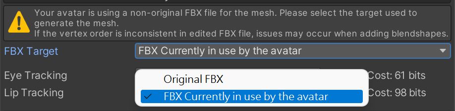

#  Face Tracking Addon Documents

Thank you for purchasing the Triturbo Face Tracking addon. This document will guide you through its usage and customization options.

Before reading this document, please first refer to the [Installation Guide](./installation-guide) to assist with installing the addon.

## Preset Options
During installation, you will see multiple preset options to choose from, including:
- HD
- HD (VIVE)
- HD (Quest, Pico)
- SD

The preset options may vary depending on the version, with more or fewer options available, each with different settings. However, all follow the naming conventions.  
HD and SD refer to **resolution** differences, with HD offering higher resolution but requiring more synced parameters. The device name in parentheses indicate optimization for specific devices; if no device is listed, it is the general version, using more parameters to ensure the best performance across all devices.  
> If you have multiple devices, it is recommended to select the general version.

::: details ⚙ Parameter Resolution
Because face tracking requires a large number of parameters and uses Expression Parameters for network synchronization, VRChat has a limit of 256 bits for this.  
- `Bool` parameters require `1` bit.  
- `Int` and `Float` require `8` bits.  

We use parameter quantization techniques to reduce the bit size needed for floating-point numbers.  
:::

### Differences Between VIVE, Quest and Pico Versions
VIVE uses SRanipal parameters, whereas the Quest and Pico devices have fewer features for eye tracking. Specifically, VIVE supports eyebrow detection, while Quest and Pico devices do not, but VIVE includes pupil diameter tracking.

Regarding mouth tracking, VIVE has features like MouthDimple, MouthStretch, and NoseSneer that are absent in Quest and Pico.

::: info 💡
The above description applies specifically to the **VIVE Pro Eye** device.
- VIVE Focus 3 + Facial Expression Tracking Kit
- VIVE Focus Vision  
- VIVE XR Elite + Full-Face Tracking Kit

These devices do not support pupil diameter tracking.\
Additionally, they do not support `EyeWide` (wide-open eyes) or `EyeSquint` (squinted eyes).  
All VIVE devices show similar performance in mouth tracking.
:::

## Mesh Generation
The face-tracking mesh with blend shapes is not included in the plugin but is generated during installation via . When installing face tracking addon on an Avatar for the first time, the tool will generate a mesh with face-tracking blendshapes.

By default, this mesh generated from the original FBX found via `guid`, not from the mesh currently in use by your avatar.\
Select `FBX currently in used by the avatar` to use the new FBX as the base to add blendshapes.

Mesh generation occurs only on the first installation. If you need to regenerate the mesh, delete the previously generated mesh and reinstall face tracking.

### Mesh Generation Failures
If the Avatar’s face is not visible after installing face tracking, check if you used a modified FBX imported as a new asset for the Avatar's mesh, which might have a different bone count from the original model.

Select `FBX currently in used by the avatar` in the **FBX Target** option. This option only appears when the mesh hasn’t yet been generated; if it has, you’ll need to regenerate the mesh.

If you notice broken blendshapes after installation, use an unmodified FBX to generate the mesh.

::: tip
**To avoid failures when adding blend shapes to a modified FBX, please note the following:**

- Do not delete vertices in the relevant mesh, and avoid adding vertices. This can cause vertex order inconsistencies.
- If blendshapes appear wrong direction, use Blender’s native exporter.
- Match FBX export Scaling settings with the original model and consider `Apply Transform` options carefully.
  - When you see 1m(File) to 1m (Unity) in Unity’s FBX Import Settings, select FBX Unit Scale in Blender.
  - Avoid selecting `Apply Transform`; if blendshapes are wrong direction, try selecting `Apply Transform` as a last resort.

**Permitted Changes:**
- Add bones and edit weights
- Add or edit blend shapes
- Edit UVs
- Edit normals
- Freely modify meshes unrelated to face tracking
:::

## Adjusting Eye Shape Resetting
This face tracking system blends some blend shapes to `0` when the eyes close to prevent clipping. This process is smooth and seamless. When eyes are open, the face shape follows user-defined blend shapes, but when eyes close, the system “resets” to `0`.

The reset intensity can be easily customized using the [Eye Tracking Settings](eye-tracking-settings) component.\
**Intensity 1** means the blend shapes fully reset to 0 when eyes close, while **Intensity 0** means no reset occurs.

### How to Adjust Blendshapes for Custom Face Shapes
You may customize the face shape of your Avatar in several ways. For proper functioning with the face-tracking system, refer to the methods below.

Adjust the blend shape values directly in the `SkinnedMeshRenderer` and upload in that state to VRChat.

Avoid relying **solely** on animation to control custom face shapes; ensure corresponding adjustments are made in the `SkinnedMeshRenderer`.

### About the separated Left and Right Blendshapes
Most blendshapes for facial adjustments have separated versions for the left and right sides. Since your eyes can open and close independently, the system uses separate controls for each eye.\
It automatically switches to the left and right versions of each blendshape, so you can adjust them as usual.

> Adjust as desired; the system will automatically switch to the left-right separated blend shapes. If issues arise, using the separated blendshapes to customize the avatar instead of combined blendshapes.

## Adjusting Jaw Drop Intensity
The blend shape that controls mouth opening and jaw drop is `JawOpen`.

`JawOpen` is divided into two blend shapes to facilitate fine-tuning:

- `JawDrop*` for jaw movement
- `MouthOpen*` for mouth opening
- 
By default, the upper jaw remains fixed while the jaw drops.

Adjust the `JawDrop*` values in the `JawOpen` animation under `Animations/` to modify the jaw drop effect.

:::info
Adjusting `JawDrop*` allows you to customize the mouth-opening effect. When `JawDrop*` is 0, the jaw remains still, and the upper jaw moves upward as the mouth opens.

When `JawDrop*` is 100, the jaw moves downward, and the upper jaw remains fixed.
:::

## Adjusting Parameter Resolution and Scaling
When viewing the face tracking object in the Inspector, you’ll see the [Quantization Parameters Creator](quantization-parameters-creator) component displayed as shown below:

Each item is a parameter used by face tracking, where you can adjust **resolution** and **scale factor**. The **resolution** affects the final synced parameter usage.

### Resolution
Quantization techniques are used to reduce synced parameter usage. In `VRC Expression Parameters`, float has an `8-bit` resolution, but lowering it appropriately can reduce synced parameter usage without overly affecting quality.

> The minimum resolution value is `0` (no sync), while the maximum is `8` (equivalent to `float`).
> 
> Setting the resolution below `2` is not recommended.
>
