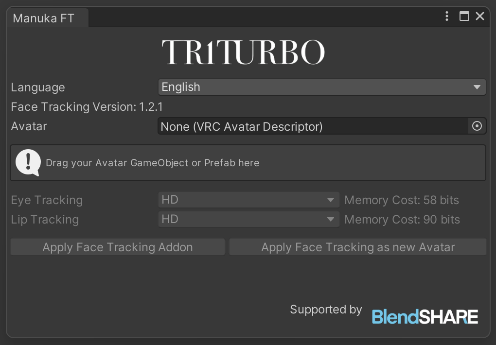
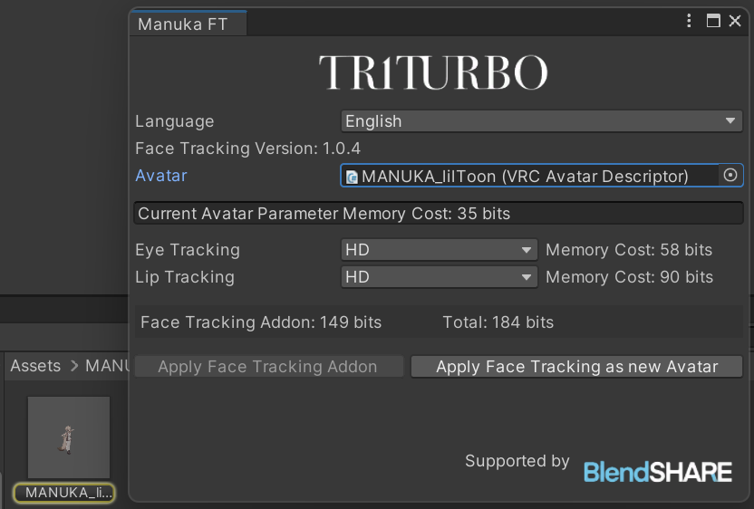

#  Face Tracking Addon Installation Guide
## Import dependent assets & packages
-  Modular Avatar (≥1.19)
- Original Avatar
- **BlendShare**:\
  a blendshapes extract and distribute tool I developed.\
*Included in file*

## Import the Face Tracking Addon
- Download contents from the [Booth store](https://triturbo.booth.pm/)
- Import `.unitypackage` to your project

A new menu will appear after import.

Click the buttom at menu to open the window.

Drag your Avatar *GameObject* or *Prefab* into `Avatar` field.

Finally, click `Apply Face Tracking Addon`.

:::tip
💡 If you don't want to modify the original avatar *GameObject*,
click `Apply Face Tracking as New Avatar` instead.
:::
An avatar with **face tracking addon** will appear in *Hierarchy*.

## How to get the FBX file?
If you need to obtain the FBX file for further modifications, please refer to the following article.

[I need an FBX file with face tracking blendshapes, where can I get it?](blendshare)

## Preset Options
During installation, you will see multiple preset options to choose from, including:
- HD
- HD (VIVE)
- HD (Quest, Pico)
- SD

The preset options may vary depending on the version, with more or fewer options available, each with different settings. However, all follow the naming conventions.  
HD and SD refer to **resolution** differences, with HD offering higher resolution but requiring more synced parameters. The device name in parentheses indicate optimization for specific devices; if no device is listed, it is the general version, using more parameters to ensure the best performance across all devices.  
> If you have multiple devices, it is recommended to select the general version.

::: details ⚙ Parameter Resolution
Because face tracking requires a large number of parameters and uses Expression Parameters for network synchronization, VRChat has a limit of 256 bits for this.  
- `Bool` parameters require `1` bit.  
- `Int` and `Float` require `8` bits.  

We use parameter quantization techniques to reduce the bit size needed for floating-point numbers.  
:::

### Differences Between VIVE, Quest and Pico Versions
VIVE uses SRanipal parameters, whereas the Quest and Pico devices have fewer features for eye tracking. Specifically, VIVE supports eyebrow detection, while Quest and Pico devices do not, but VIVE includes pupil diameter tracking.

Regarding mouth tracking, VIVE has features like MouthDimple, MouthStretch, and NoseSneer that are absent in Quest and Pico.  
::: info 💡 The above description applies specifically to the **VIVE Pro Eye** device  

- VIVE Focus 3 + Facial Expression Tracking Kit
- VIVE Focus Vision  
- VIVE XR Elite + Full-Face Tracking Kit
These devices do not support pupil diameter tracking.\
Additionally, they do not support `EyeWide` (wide-open eyes) or `EyeSquint` (squinted eyes).  
All VIVE devices show similar performance in mouth tracking.
:::