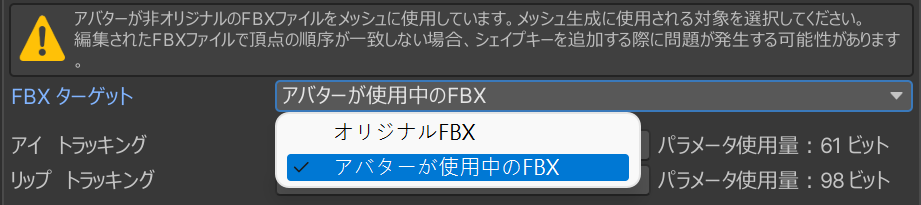

#  フェイストラッキングアドオン ドキュメント

Triturboのフェイストラッキングアドオンを購入していただき、ありがとうございます。このドキュメントでは、その使用方法やカスタマイズオプションについてご案内します。

このドキュメントを読む前に、まず[インストールガイド](./installation-guide)を参照して、アドオンのインストールを行ってください。

## プリセットオプション
インストール時に、以下のようなプリセットオプションが表示されます：
- HD
- HD (VIVE)
- HD (Quest, Pico)
- SD

プリセットオプションはバージョンによって異なり、より多くのオプションや少ないオプションが用意されている場合がありますが、それぞれ設定が異なります。
HDとSDは**解像度**の違いを指し、HDは高解像度ですが、同期するパラメータが多くなります。括弧内のデバイス名は特定のデバイス向けに最適化されていることを示し、デバイス名が記載されていない場合は、すべてのデバイスで最適なパフォーマンスを提供するために多くのパラメータを使用する一般バージョンです。
> 複数のデバイスをお持ちの場合は、一般バージョンを選択することをお勧めします。

::: details ⚙ パラメータの解像度
フェイストラッキングには多くのパラメータが必要で、Expression Parametersをネットワーク同期に使用しますが、VRChatではこれに256ビットの制限があります。  
- `Bool` パラメータは `1` ビットを必要とします。  
- `Int` と `Float` は `8` ビットを必要とします。

私たちは浮動小数点数のビットサイズを減らすためのパラメータの量子化技術を使用しています。
:::

### VIVEとQuest、Picoバージョンの違い
- VIVEはSRanipalパラメータを使用し、QuestやPicoのデバイスと比較して：
  - 目に関しては、眉毛の検出がなく、代わりに瞳孔の直径の検出があります。
  - 口に関しては、MouthDimple、MouthStretch、NoseSneerの検出がありません。

::: info 💡 上記の説明はVIVE Pro Eyeデバイスにのみ該当します。
- VIVE Focus 3 + Facial Expression Tracking Kit
- VIVE Focus Vision
- VIVE XR Elite + Full-Face Tracking Kit

上記のデバイスは瞳孔の直径検出をサポートしておらず、また`EyeWide`（目を大きく開ける）や`EyeSquint`（目を細める）もサポートしていません。口のキャプチャに関しては、各VIVEデバイスは基本的に同じパフォーマンスを示します。
:::

## メッシュ生成
フェイストラッキング用メッシュとブレンドシェイプはプラグインに含まれていませんが、インストール時に  経由で生成されます。アバターに初めてフェイストラッキングアドオンをインストールする際、ツールはフェイストラッキングのブレンドシェイプを持つメッシュを生成します。

デフォルトでは、このメッシュは `guid` を通じて見つけた元のFBXから生成され、現在使用中のメッシュではありません。\
`アバターが現在使用しているFBX` を選択すると、新しいFBXを基にブレンドシェイプを追加します。

メッシュの生成は最初のインストール時のみ行われます。メッシュの再生成が必要な場合は、以前生成されたメッシュを削除し、フェイストラッキングを再インストールしてください。

### メッシュ生成の失敗
フェイストラッキングをインストールした後にアバターの顔が表示されない場合、アバターのメッシュに新しいアセットとしてインポートされた変更されたFBXを使用しているかどうか確認してください。これは元のモデルと異なるボーン数を持つ可能性があります。

**FBXターゲット** オプションで `アバターが現在使用しているFBX` を選択してください。このオプションは、メッシュがまだ生成されていない場合にのみ表示されます。既に生成されている場合は、メッシュを再生成する必要があります。

インストール後にブレンドシェイプが壊れていることに気づいた場合は、変更されていないFBXを使用してメッシュを生成してください。

::: tip
**変更されたFBXにブレンドシェイプを追加する際の失敗を避けるためには、以下の点に注意してください:**

- 該当するメッシュの頂点を削除しないでください。また、頂点を追加しないでください。これにより頂点の順序が不整合になる可能性があります。
- ブレンドシェイプが逆方向に表示される場合は、Blenderのネイティブエクスポーターを使用してください。
- FBXのエクスポート時、Scale設定を元のモデルと一致させること、および `Apply Transform` オプションを慎重に考慮してください。
  - UnityのFBXインポート設定で1m(File) to 1m (Unity)と表示される場合、BlenderではFBX Unit Scaleを選択してください。
  - `Apply Transform` を選択しないようにし、ブレンドシェイプの方向が間違っている場合は最後の手段として `Apply Transform` を試してください。
    

**許可される変更:**
- ボーンを追加し、重みを編集
- ブレンドシェイプの追加や編集
- UVの編集
- 法線の編集
- フェイストラッキングに関連しないメッシュの自由な変更
:::

## 目の形状のリセットの調整
このフェイストラッキングシステムは、目が閉じたときにクリッピングを防ぐために、いくつかのブレンドシェイプを `0` にブレンドします。このプロセスは滑らかでシームレスです。目が開いている間はユーザー定義のブレンドシェイプに従いますが、目が閉じるとシステムは `0` に「リセット」します。

リセットの強度は [Eye Tracking Settings](./eye-tracking-settings) コンポーネントを使用して簡単にカスタマイズできます。\
**Intensity 1** は目の閉じた際にブレンドシェイプが完全に0にリセットされることを意味し、**Intensity 0** はリセットが行われないことを意味します。

### カスタムフェイスシェイプのためのブレンドシェイプの調整方法
アバターのフェイスシェイプをいくつかの方法でカスタマイズできます。フェイストラッキングシステムと適切に機能させるために、以下の方法を参照してください。

`SkinnedMeshRenderer` 内で直接ブレンドシェイプの値を調整し、その状態でVRChatにアップロードします。

カスタムフェイスシェイプの制御に**アニメーションだけに頼る**のではなく、`SkinnedMeshRenderer` での対応する調整を行ってください。

### 分離された左と右のブレンドシェイプについて
ほとんどのフェイスの調整用のブレンドシェイプは、左と右のバージョンが別々に用意されています。あなたの目は独立して開閉できるため、システムは各目を個別に制御します。\
通常どおり調整を行うと、システムは自動的に左右のブレンドシェイプに切り替えます。

> 希望どおりに調整してください。システムが自動的に左右のブレンドシェイプに切り替えます。問題が発生した場合は、結合されたブレンドシェイプではなく、分離されたブレンドシェイプを使用してアバターをカスタマイズしてください。

## 顎の開き具合の調整
口を開く動作や顎の開きを制御するブレンドシェイプは `JawOpen` です。

`JawOpen` は微調整を容易にするために二つのブレンドシェイプに分かれています：

- `JawDrop*` 顎の動き用
- `MouthOpen*` 口の開き用

デフォルトでは、上顎は固定され、顎が下がります。

`Animations/` 内の `JawOpen` アニメーションの `JawDrop*` の値を調整することで、顎の開き具合を変更できます。

:::info
`JawDrop*` の調整により、口の開き効果をカスタマイズできます。`JawDrop*` が0の場合、顎は動かず、口が開くと上顎が上に動きます。

`JawDrop*` が100の場合、顎が下に動き、上顎は固定されます。
:::

## パラメータの解像度とスケールの調整
フェイストラッキングオブジェクトをインスペクターで見ると、以下のように [Quantization Parameters Creator](./quantization-parameters-creator) コンポーネントが表示されます：

各項目はフェイストラッキングで使用されるパラメータであり、**解像度**と**スケールファクター**を調整できます。**解像度**は最終的に同期されるパラメータの使用量に影響します。

### 解像度
量子化技術を利用して同期されるパラメータの使用量を減らしています。`VRC Expression Parameters` では、floatは`8ビット`の解像度を持ちますが、適切に下げることで同期されるパラメータの使用量を減らすことができます。

> 解像度の最小値は `0`（同期なし）、最大値は `8`（`float` と同等）です。
>
> 解像度を `2` 以下に設定することは推奨されません。