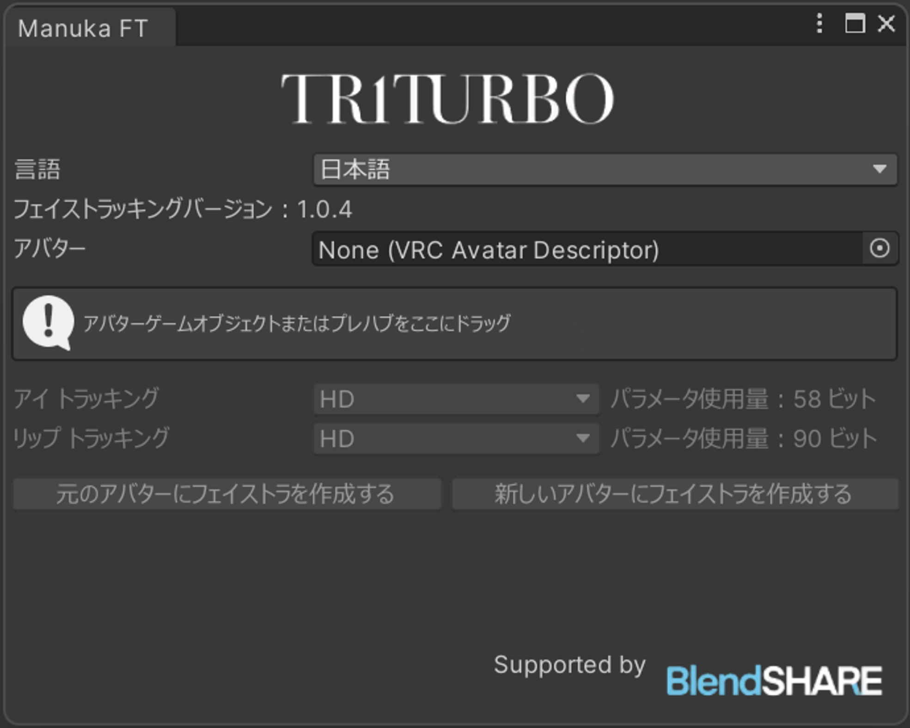
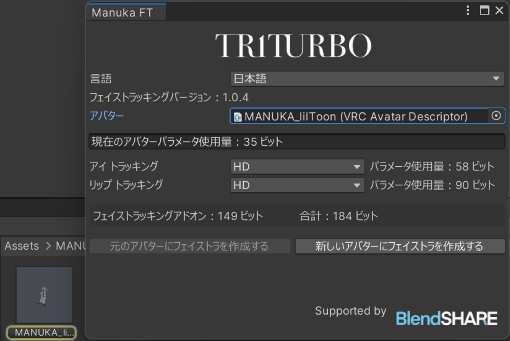

#  顔追跡アドオンのインストールガイド
## 依存するアセットとパッケージのインポート
-  Modular Avatar (≥1.19)
- アバター本体
- **BlendShare**：私が開発したシェイプキーの抽出と配布ツール。\
*ファイルに含まれています*

## 顔追跡アドオンのインポート
- **コンテンツのダウンロード**\
[Booth](https://triturbo.booth.pm/) からコンテンツをダウンロードしてください。
- **Unity パッケージのインポート**\
`.unitypackage` をインポートしてください。

インポート後、新しいメニュー `TriturboFT` が表示されます。

メニューのボタンをクリックしてウィンドウを開いてください。

アバターのGameObjectまたはPrefabを`アバター`フィールドにドラッグしてください。

最後に、`元のアバターにフェストラを作成する`をクリックしてください。

:::info
💡 オリジナルのアバターGameObjectを変更したくない場合は、代わりに`新しいアバターにフェストラを作成する`をクリックしてください。
:::

顔追跡アドオン付きのアバターがHierarchyに表示されます。

## FBXファイルの取得方法  
FBXファイルを取得してさらに変更を加える場合は、以下の記事をご参照ください。\
[フェイストラッキング用のブレンドシェイプ付きFBXファイルが必要です。どこで入手できますか？](blendshare)

## プリセットオプション  
インストール時に、以下のような複数のプリセットオプションが表示されます：
- HD
- HD (VIVE)
- HD (Quest, Pico)
- SD

プリセットオプションはバージョンによって異なり、設定が多かったり少なかったりしますが、全て名前付け規則に従います。  
HDとSDは**解像度**の違いを指し、HDはより高解像度で、より多くの同期パラメーターを必要とします。カッコ内のデバイス名は特定のデバイスに最適化されていることを示します。デバイス名がない場合は汎用バージョンで、全デバイスで最高のパフォーマンスを確保するために多くのパラメーターを使用します。  
> 複数のデバイスをお持ちの場合は、汎用バージョンを選択することをお勧めします。

::: details ⚙ パラメーター解像度  
フェイストラッキングには多くのパラメーターが必要で、ネットワーク同期にはExpression Parametersを使用します。VRChatの上限は256ビットです。  
- `Bool`パラメーターは`1`ビットを使用します。  
- `Int`および`Float`は`8`ビットを使用します。

浮動小数点数のビットサイズを削減するために、パラメーター量子化技術を使用しています。  
:::

### VIVEとQuest、Picoバージョンの違い
- VIVEはSRanipalパラメータを使用し、QuestやPicoのデバイスと比較して：
  - 目に関しては、眉毛の検出がなく、代わりに瞳孔の直径の検出があります。
  - 口に関しては、MouthDimple、MouthStretch、NoseSneerの検出がありません。

::: info 💡 上記の説明はVIVE Pro Eyeデバイスにのみ該当します。
- VIVE Focus 3 + Facial Expression Tracking Kit
- VIVE Focus Vision
- VIVE XR Elite + Full-Face Tracking Kit

上記のデバイスは瞳孔の直径検出をサポートしておらず、また`EyeWide`（目を大きく開ける）や`EyeSquint`（目を細める）もサポートしていません。口のキャプチャに関しては、各VIVEデバイスは基本的に同じパフォーマンスを示します。
:::