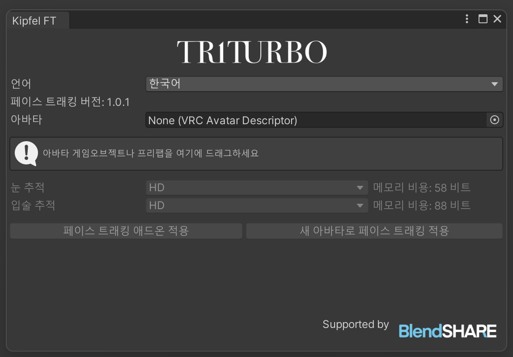
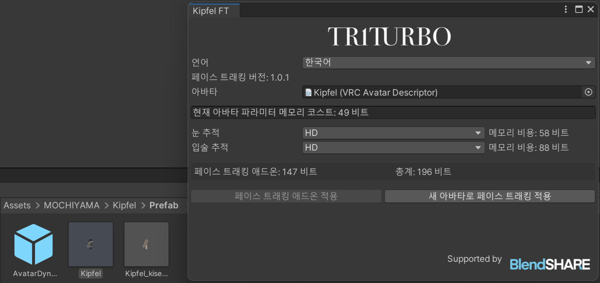

#  페이셜트레킹 애드온 설치 가이드
## 에셋 및 패키지 임포트하기
- [모듈러아바타](https://modular-avatar.nadena.dev/) (≥1.19)
- 오리지널 아바타
- **BlendShare**：제작자가 개발한 블렌드쉐이프 추출 및 배포도구입니다.\
*페이셜 파일에 포함됨*

## Face Tracking Addon 임포트
- **콘텐츠 다운로드**\
[Booth](https://triturbo.booth.pm/) 샵에서 패키지 다운로드.
- **Unity 패키지 임포트**\
프로젝트에 `.unitypackage` 임포트.

임포트 한 후 새 메뉴가 나타납니다.

TriturboFT 메뉴를 클릭한 후 창을 열어주세요.

Hierarchy 에 있는 아바타 오브젝트나 프리팹을 상자로 끌어다 놓습니다.

마지막으로 페이스 트래킹 애드온 적용 을 클릭합니다.

:::info
💡 원래 아바타의 수정을 원하지 않으시면, `새 아바타로 페이스 트래킹 적용` 를 클릭합니다.
:::

페이셜이 적용되어있는 아바타가 Hierarchy 에 나옵니다.

### 번역하다
[@ssoni_vrc](https://x.com/ssoni_vrc)
## FBX 파일 획득 방법  
FBX 파일을 획득하여 추가 수정을 하고 싶다면, 아래의 기사를 참고하세요.

[페이스 트래킹 블렌드셰이프가 포함된 FBX 파일이 필요합니다. 어디에서 구할 수 있나요?](blendshare)

## 프리셋 옵션  
설치 시 다음과 같은 여러 프리셋 옵션이 표시됩니다:
- HD
- HD (VIVE)
- HD (Quest, Pico)
- SD

프리셋 옵션은 버전에 따라 달라지며, 설정이 더 많거나 적을 수 있지만, 모두 명명 규칙을 따릅니다.  
HD와 SD는 **해상도** 차이를 나타내며, HD는 더 높은 해상도를 제공하지만 더 많은 동기화 파라미터가 필요합니다. 괄호 안에 있는 장치 이름은 특정 장치에 최적화된 것을 나타내며, 장치 이름이 없는 경우에는 일반 버전으로, 모든 장치에서 최상의 성능을 보장하기 위해 더 많은 파라미터를 사용합니다.  
> 여러 장치를 가지고 있다면 일반 버전을 선택하는 것을 권장합니다.

::: details ⚙ 파라미터 해상도  
페이스 트래킹에는 많은 파라미터가 필요하며, 네트워크 동기화를 위해 Expression Parameters를 사용합니다. VRChat의 제한은 256비트입니다.  
- `Bool` 파라미터는 `1` 비트를 사용합니다.  
- `Int` 및 `Float`은 `8` 비트를 사용합니다.

우리는 부동소수점 숫자에 필요한 비트 크기를 줄이기 위해 파라미터 양자화 기술을 사용합니다.  
:::

### VIVE, Quest 및 Pico 버전의 차이점  
VIVE는 SRanipal 파라미터를 사용하지만, Quest 및 Pico 장치에는 눈 추적 기능이 적습니다. 구체적으로 VIVE는 눈썹 검출을 지원하지만, Quest와 Pico 장치는 지원하지 않으며 VIVE는 동공 직경 추적도 가능합니다.

입 추적의 경우, VIVE에는 MouthDimple, MouthStretch, NoseSneer 등의 기능이 있지만, Quest와 Pico에는 없습니다.  
::: info 💡 위 설명은 특히 **VIVE Pro Eye** 장치에 해당됩니다.  

- VIVE Focus 3 + Facial Expression Tracking Kit  
- VIVE Focus Vision  
- VIVE XR Elite + Full-Face Tracking Kit  
이 장치들은 동공 직경 추적을 지원하지 않습니다.  
또한 `EyeWide`(눈을 크게 뜸)와 `EyeSquint`(눈을 가늘게 뜸)도 지원하지 않습니다.  
모든 VIVE 장치는 입 추적에서 유사한 성능을 보입니다.  
:::