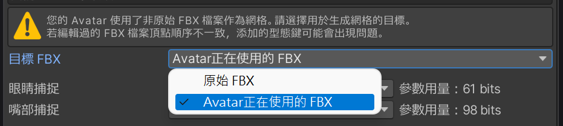

#  面捕文档

感谢您购买 Triturbo 的面部捕捉插件，本篇文章将向您解释其中的使用与修改方法。

在阅读本篇文章前，请先阅读 [安装指南](./installation-guide) 以带领您安装本插件。

## 安装与预设选项
在安装时，你会看到有多个预设选项可选，其中包含：
- HD
- HD (VIVE)
- HD (Quest, Pico)
- SD

预设选项会因版本不同而有更多或更少的种类，其中的的设定也各自不同，但是都会遵守命名规则。\
HD 与 SD 代表者**解析度**的不同，HD有着更高的解析度但是需要更多的同步参数。（括号）内表示针对该设备进一步优化参数的使用量，若不标注设备，则为通用版本，使用更多参数保证所有设备有着最佳效果。
> 若您有多种设备，请选择通用版本。
::: details ⚙ 参数的解析度
由于面捕需要大量参数，并且透过Expression Parameters 进行网路同步，而VRChat对此上限为 256 比特。

- `Bool` 参数需要 `1` 比特。
- `Int` 和 `Float` 需要 `8` 比特。

我们透过量化参数的技巧降低浮点数所需的比特数。
:::

### VIVE 与 Quest, Pico 版本的差异

VIVE 使用 SRanipal 参数相较 Quest 与 Pico 设备在眼睛方面少了眉毛侦测、多了瞳孔直径。
而在嘴部少了 `MouthDimple`、`MouthStretch` 和 `NoseSneer`。

::: info 💡 上述说明仅代表 VIVE Pro Eye设备
- VIVE Focus 3 + 表情侦测套件
- VIVE Focus Vision
- VIVE XR Elite + 全脸侦测套件

等上述设备不支持瞳孔直径侦测，另外也不支持EyeWide（睁大眼睛）, EyeSquint（挤压眼皮）。\
而在嘴部捕捉部分各个VIVE设备基本表现一致。
:::

## 网格的生成

添加面捕用型态键的网格并不包含于本插件内，而是通过  在您安装面捕时生成。
当您第一次为Avatar安装面捕，工具会为您生成带有面捕用型态键的网格。

该网格默认透过 `guid` 查找，并由原 FBX 生成，并非是当前安装对象正在使用的网格。
若需要以新 FBX 为目标添加型态键，请选择 `Avatar正在使用中的 FBX`。

网格的生成仅在第一次安装时发生，若您需要重新生成网格，请删除本工具所生成的网格然后重新安装面捕。

### 网格生成失败

若您在安装面捕后看不见Avatar的脸，请检查您是否使用了修改过的，并且作为新资产导入的FBX作为Avatar的网格，该FBX的骨骼数量可能与原模型不一致。

请在**目标FBX**中选择 `Avatar正在使用中的 FBX`。该选项只在尚未生成网格时出现，若您已生成网格，请重新生成网格。

若您在安装面捕后发现型态键破碎，请使用未修改过的FBX生成网格。

::: tip 
**要避免修改过的FBX在添加型态键失败，请注意以下要点：**

- 在修改过程中不得**删除**相关网格的顶点，且不建议添加顶点。这会导致顶点顺序不一致。
- 如果发现型态键方向错误，请使用 Blender 原生导出器。
- 注意FBX导出时的 Scalings 设定，和 `Apply Transform` 选项。您需要与原模型保持一致。
  - 当您在 Unity 的 FBX Import Settings 中看到 `1m(File) to 1m (Unity)` 时，请在 Blender 选择 `FBX Unit Scale`。
  - 请不要勾选 `Apply Transform`，如果发现型态键方向错误，请再尝试勾选 `Apply Transform`。
  

**可以放心更改的部分：**
- 添加骨骼和编辑权重
- 添加或编辑型态键
- 编辑 UV
- 编辑法线
- 可以任意编辑与面捕无关的网格
:::

## 调整眼睛形状修復
本面捕会在眼睛闭合时将部分型态键混合至 0 以避免穿模，该过程相当自然连续。在正常睁眼时，脸型为用户所自定义的型态键，闭眼时会「重设」至 0。

重设的强度可以透过 [Eye Tracking Settings](./eye-tracking-settings) 自定义， **强度 1** 代表当眼睛闭上时完全重设至 0，而**强度 0** 表示不重设。

### 如何调整型态键以自订义面部形状
为您的Avatar自订脸型可能有多种方式。为了使面捕系统可以正常运行，请参考以下方法。

请在 `SkinedMeshRenderer` 中直接调整Blendshapes滑条的值，并以该状态上传至VRChat。

> 请不要**仅**使用动画控制自定义脸型，务必在 `SkinedMeshRenderer` 中也做出相应的调整。

### 有关左右型态键
大部分调整脸型用的型态键会提供左右分离版本。由于您的左右眼可以独立开合，因此要混合脸型型态键时也需要两眼分离控制，因此需要使用左右分离的型态键调整脸型（尤其是眼睛相关的形状），然而本系统会自动地将对应的型态键改为左右分离的版本，因此您可以按照往常一般调整。

> 自由调整即可，系统会自动替换成左右分离型态键。若遇到问题，请在调整型态键一开始就使用左右分离的型态键。

## 调整下巴掉落幅度
驱动嘴巴开口，下巴掉落的型态键为 JawOpen。

其中，JawOpen又被分为 2 种型态键以方便微调。
- `JawDrop*` 下巴移动
- `MouthOpen*` 张嘴

预设为上颚不动，下巴掉落。您可以更改动画来调整下巴掉落的幅度。

请在 `Animations/` 下找到 `JawOpen` 动画，依照喜好调整 `JawDrop*` 的值。

:::info
您可以透过更改 `JawDrop*` 调整张嘴的效果。\
当 `JawDrop*` 为 0 时，下巴保持不动，嘴巴打开且上颚向上移动。

当 `JawDrop*` 为 100 时，下巴向下移动，嘴巴打开且上颚保持不动。
:::

## 调整参数解析度与缩放
使用 Inspector 查看面捕游戏物件时，您可以看到 [Quantization Parameters Creator](./quantization-parameters-creator) 组件，如以下画面：

其中每一项为面捕使用的参数，您可以调整**解析度**与**缩放**，其中**解析度**会影响最终需要的同步参数用量。

### 解析度
使用量化技术降低同步参数用量，VRC Expression parameters 中 `float` 为 `8 bit` 解析度，适当降低可以在不过度影响效果的同时降低需要的同步参数。

> 解析度最低值为 `0` (不同步)，最高值为 `8` (相当于float)。
> 
> 不建议将解析度设定至 `2` 以下。