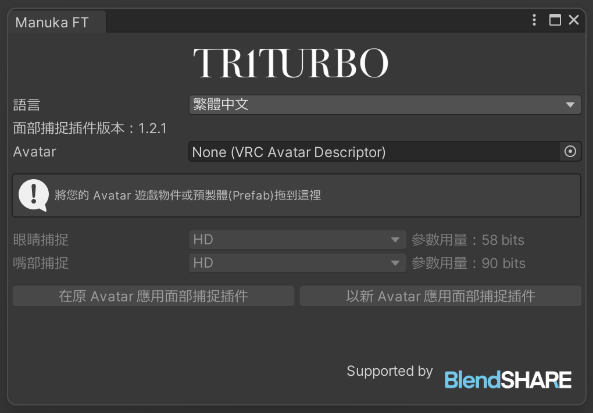
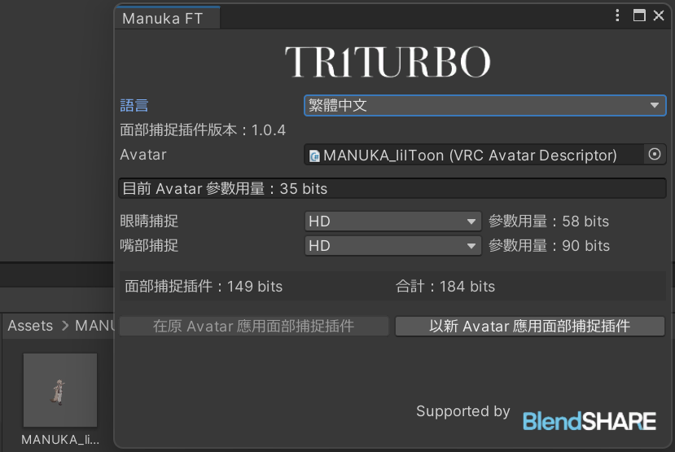

#  面捕插件安装指南

## 导入依赖资产和包
-  Modular Avatar (≥1.19)
- Avatar 本体
- **BlendShare**：一个我开发的型态键提取和分发工具。\
*已包含在文件中*

- 新增: **Triturbo Face Tracking Framework**\
   
    请从 BOOTH 下载。（部分旧版插件可能不需要此更新）
    如果它出现在 BOOTH 下载页面上，请务必下载。

## 导入面部追踪插件
- 从 [Booth 商店](https://triturbo.booth.pm/) 中下载内容。
- 将 `.unitypackage` 导入到你的项目中。

导入后将出现一个新菜单 `TriturboFT`。

点击菜单中的按钮以打开窗口。

将你的 Avatar 游戏物体或预製件拖入 `Avatar` 框中。

最后，点击 `在原 Avatar 应用面部捕捉插件`。

:::info
💡 如果你不想修改原 Avatar 游戏物体，可以点击 `以新 Avatar 应用面部捕捉插件`。
:::
一个带有面部追踪插件的 Avatar 将出现在 Hierarchy 中。

## 如何取得FBX档案？
如果您需要取得FBX档案进行进一步修改，请参考以下文章。

[我需要一个带有型态键的FBX文件，在哪里可以获得？](./blendshare)

## 预设选项
在安装时，你会看到有多个预设选项可选，其中包含：
- HD
- HD (VIVE)
- HD (Quest, Pico)
- SD

预设选项会因版本不同而有更多或更少的种类，其中的的设定也各自不同，但是都会遵守命名规则。\
HD 与 SD 代表者**解析度**的不同，HD有着更高的解析度但是需要更多的同步参数。（括号）内表示针对该设备进一步优化参数的使用量，若不标注设备，则为通用版本，使用更多参数保证所有设备有着最佳效果。
> 若您有多种设备，请选择通用版本。
::: details ⚙ 参数的解析度
由于面捕需要大量参数，并且透过Expression Parameters 进行网路同步，而VRChat对此上限为 256 比特。

- `Bool` 参数需要 `1` 比特。
- `Int` 和 `Float` 需要 `8` 比特。

我们透过量化参数的技巧降低浮点数所需的比特数。
:::

### VIVE 与 Quest, Pico 版本的差异

VIVE 使用 SRanipal 参数相较 Quest 与 Pico 设备在眼睛方面少了眉毛侦测、多了瞳孔直径。
而在嘴部少了 MouthDimple, MouthStretch, NoseSneer。

::: info 💡 上述说明仅代表 VIVE Pro Eye设备
- VIVE Focus 3 +  表情侦测套件
- VIVE Focus Vision
- VIVE XR Elite + 全脸侦测套件

等上述设备不支持瞳孔直径侦测，另外也不支持EyeWide（睁大眼睛）, EyeSquint（挤压眼皮）。\
而在嘴部捕捉部分各个VIVE设备基本表现一致。
:::