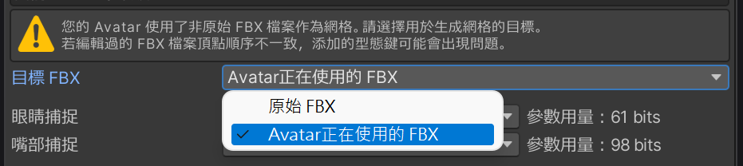

#  面捕文檔

感謝您購買 Triturbo 的面部捕捉套件，本篇文章將向您解釋其中的使用與修改方法。

在閱讀本篇文章前，請先閱讀 [安裝指南](./installation-guide) 以帶領您安裝本套件。

## 安裝與預設選項
在安裝時，你會看到有多個預設選項可選，其中包含：
- HD
- HD (VIVE)
- HD (Quest, Pico)
- SD

預設選項會因版本不同而有更多或更少的種類，其中的的設定也各自不同，但是都會遵守命名規則。\
HD 與 SD 代表者**解析度**的不同，HD有著更高的解析度但是需要更多的同步參數。（括號）內表示針對該設備進一步優化參數的使用量，若不標注設備，則為通用版本，使用更多參數保證所有設備有著最佳效果。
> 若您有多種設備，請選擇通用版本。
::: details ⚙ 參數的解析度
由於面捕需要大量參數，並且透過 Expression Parameters 進行網路同步，而VRChat對此上限為 256 比特。

- `Bool` 參數需要 `1` 比特。
- `Int` 和 `Float` 需要 `8` 比特。

我們透過量化參數的技巧降低浮點數所需的比特數。
:::

### VIVE 與 Quest, Pico 版本的差異

VIVE 使用 SRanipal 參數相較 Quest 與 Pico 設備在眼睛方面少了眉毛偵測、多了瞳孔直徑。
而在嘴部少了 `MouthDimple`、`MouthStretch` 和 `NoseSneer`。

::: info 💡 上述說明僅代表 VIVE Pro Eye設備
- VIVE Focus 3 + 表情偵測套件
- VIVE Focus Vision
- VIVE XR Elite + 全臉偵測套件

等上述設備不支持瞳孔直徑偵測，另外也不支持EyeWide（睜大眼睛）, EyeSquint（擠壓眼皮）。\
而在嘴部捕捉部分各個VIVE設備基本表現一致。
:::

## 網格的生成

添加面捕用型態鍵的網格並不包含於本插件內，而是通過  在您安裝面捕時生成。
當您第一次為Avatar安裝面捕，工具會為您生成帶有面捕用型態鍵的網格。

該網格默認透過 `guid` 查找，並由原 FBX 生成，並非是當前安裝對象正在使用的網格。
若需要以新 FBX 為目標添加型態鍵，請選擇 `Avatar正在使用中的 FBX`。

網格的生成僅在第一次安裝時發生，若您需要重新生成網格，請刪除本工具所生成的網格然後重新安裝面捕。

### 網格生成失敗

若您在安裝面捕後看不見Avatar的臉，請檢查您是否使用了修改過的，並且作為新資產導入的FBX作為Avatar的網格，該FBX的骨骼數量可能與原模型不一致。

請在**目標FBX**中選擇 `Avatar正在使用中的 FBX`。該選項只在尚未生成網格時出現，若您已生成網格，請重新生成網格。

若您在安裝面捕後發現型態鍵破碎，請使用未修改過的FBX生成網格。

::: tip 
**要避免修改過的FBX在添加型態鍵失敗，請注意以下要點：**

- 在修改過程中不得**刪除**相關網格的頂點，且不建議添加頂點。這會導致頂點順序不一致。
- 如果發現型態鍵方向錯誤，請使用 Blender 原生導出器。
- 注意FBX導出時的 Scalings 設定，和 `Apply Transform` 選項。您需要與原模型保持一致。
  - 當您在 Unity 的 FBX Import Settings 中看到 `1m(File) to 1m (Unity)` 時，請在 Blender 選擇 `FBX Unit Scale`。
  - 請不要勾選 `Apply Transform`，如果發現型態鍵方向錯誤，請再嘗試勾選 `Apply Transform`。
  

**可以放心更改的部分：**
- 添加骨骼和編輯權重
- 添加或編輯型態鍵
- 編輯 UV
- 編輯法線
- 可以任意編輯與面捕無關的網格
:::

## 調整眼睛形狀修復
本面捕會在眼睛閉合時將部分型態鍵混合至 0 以避免穿模，該過程相當自然連續。在正常睜眼時，臉型為用戶所自定義的型態鍵，閉眼時會「重設」至 0。

重設的強度可以透過 [Eye Tracking Settings](./eye-tracking-settings) 自定義， **強度 1** 代表當眼睛閉上時完全重設至 0，而**強度 0** 表示不重設。

### 如何調整型態鍵以自訂義面部形狀
為您的Avatar自訂臉型可能有多種方式。為了使面捕系統可以正常運行，請參考以下方法。

請在 `SkinedMeshRenderer` 中直接調整Blendshapes滑條的值，並以該狀態上傳至VRChat。

> 請不要**僅**使用動畫控制自定義臉型，務必在 `SkinedMeshRenderer` 中也做出相應的調整。

### 有關左右型態鍵
大部分調整臉型用的型態鍵會提供左右分離版本。由於您的左右眼可以獨立開合，因此要混合臉型型態鍵時也需要兩眼分離控制，因此需要使用左右分離的型態鍵調整臉型（尤其是眼睛相關的形狀），然而本系統會自動地將對應的型態鍵改為左右分離的版本，因此您可以按照往常一般調整。

> 自由調整即可，系統會自動替換成左右分離型態鍵。若遇到問題，請在調整型態鍵一開始就使用左右分離的型態鍵。

## 調整下巴掉落幅度
驅動嘴巴開口，下巴掉落的型態鍵為 JawOpen。

其中，JawOpen又被分為 2 種型態鍵以方便微調。
- `JawDrop*` 下巴移動
- `MouthOpen*` 張嘴

預設為上顎不動，下巴掉落。您可以更改動畫來調整下巴掉落的幅度。

請在 `Animations/` 下找到 `JawOpen` 動畫，依照喜好調整 `JawDrop*` 的值。

:::info
您可以透過更改 `JawDrop*` 調整張嘴的效果。\
當 `JawDrop*` 為 0 時，下巴保持不動，嘴巴打開且上顎向上移動。

當 `JawDrop*` 為 100 時，下巴向下移動，嘴巴打開且上顎保持不動。
:::

## 調整參數解析度與縮放
使用 Inspector 查看面捕遊戲物件時，您可以看到 [Quantization Parameters Creator](./quantization-parameters-creator) 組件，如以下畫面：

其中每一項為面捕使用的參數，您可以調整**解析度**與**縮放**，其中**解析度**會影響最終需要的同步參數用量。

### 解析度
使用量化技術降低同步參數用量，VRC Expression parameters 中 `float` 為 `8 bit` 解析度，適當降低可以在不過度影響效果的同時降低需要的同步參數。

> 解析度最低值為 `0` (不同步)，最高值為 `8` (相當於float)。
> 
> 不建議將解析度設定至 `2` 以下。

