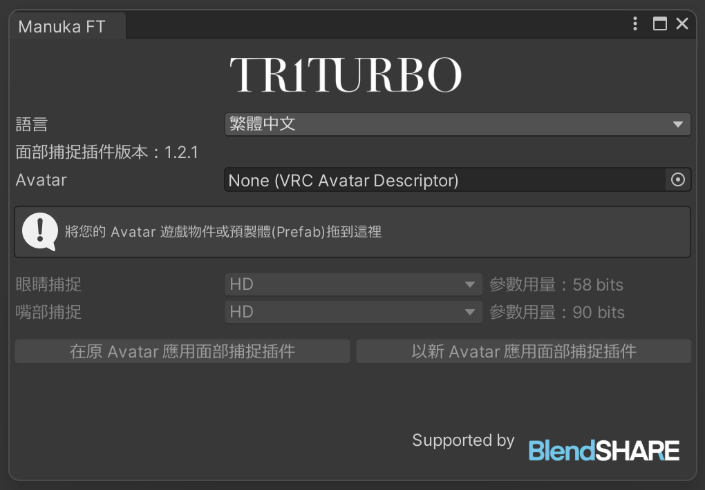
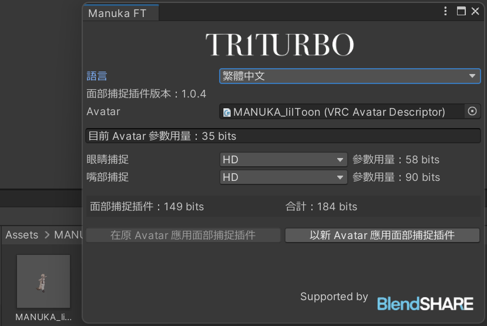

#  面捕套件安裝指南

## 導入依賴資產和包
-  Modular Avatar (≥1.19)
- Avatar 本體
- **BlendShare**：一個我開發的型態鍵提取和分發工具。\
*已包含在文件中*

## 導入面部追蹤套件
- 從 [Booth 商店](https://triturbo.booth.pm/) 中下載內容。
- 將 `.unitypackage` 導入到你的項目中。

導入後將出現一個新菜單 `TriturboFT`。

點擊菜單中的按鈕以打開窗口。

將你的 Avatar 遊戲物體或預製件拖入 `Avatar` 框中。

最後，點擊 `在原 Avatar 應用面部捕捉插件`。

:::info
💡 如果你不想修改原 Avatar 遊戲物體，可以點擊 `以新 Avatar 應用面部捕捉插件`。
:::
一個帶有面部追蹤套件的 Avatar 將出現在 Hierarchy 中。

## 如何取得FBX檔案？
如果您需要取得FBX檔案進行進一步修改，請參考以下文章。

[我需要一個帶有型態鍵的FBX文件，在哪裡可以獲得？](./blendshare)

## 預設選項
在安裝時，你會看到有多個預設選項可選，其中包含：
- HD
- HD (VIVE)
- HD (Quest, Pico)
- SD

預設選項會因版本不同而有更多或更少的種類，其中的的設定也各自不同，但是都會遵守命名規則。\
HD 與 SD 代表者**解析度**的不同，HD有著更高的解析度但是需要更多的同步參數。（括號）內表示針對該設備進一步優化參數的使用量，若不標注設備，則為通用版本，使用更多參數保證所有設備有著最佳效果。
> 若您有多種設備，請選擇通用版本。
::: details ⚙ 參數的解析度
由於面捕需要大量參數，並且透過Expression Parameters 進行網路同步，而VRChat對此上限為 256 比特。

- `Bool` 參數需要 `1` 比特。
- `Int` 和 `Float` 需要 `8` 比特。

我們透過量化參數的技巧降低浮點數所需的比特數。
:::

### VIVE 與 Quest, Pico 版本的差異

VIVE 使用 SRanipal 參數相較 Quest 與 Pico 設備在眼睛方面少了眉毛偵測、多了瞳孔直徑。
而在嘴部少了 MouthDimple, MouthStretch, NoseSneer。

::: info 💡 上述說明僅代表 VIVE Pro Eye設備
- VIVE Focus 3 +  表情偵測套件
- VIVE Focus Vision
- VIVE XR Elite + 全臉偵測套件

等上述設備不支持瞳孔直徑偵測，另外也不支持EyeWide（睜大眼睛）, EyeSquint（擠壓眼皮）。\
而在嘴部捕捉部分各個VIVE設備基本表現一致。
:::